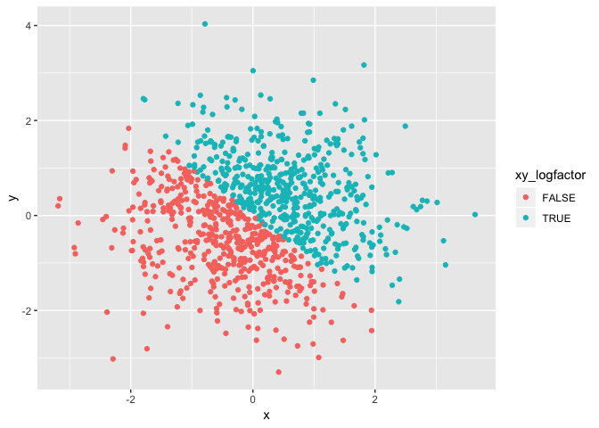

p8105\_hw1\_rj2543
================
rj2543
2018/9/15

Problem 1
=========

This problem focuses on variable types and coercion.
----------------------------------------------------

First, create a data frame comprised of:

-   A random sample of size 10 from a uniform\[0, 5\] distribution
-   A logical vector indicating whether elements of the sample are greater than 2
-   A (length-10) character vector
-   A (length-10) factor vector

``` r
problem1_df = tibble(
  sample_numeric = runif(10, min = 0, max = 5),
  sample_logical = c(sample_numeric > 2),
  sample_char = c("a", "random", "sample", "of", "size", "ten", "from", "uniform", "zero", "five"),
  sample_factor = factor(c("odd", "even", "odd", "even", "even", "odd", "odd", "odd", "even", "even"))
)
```

Try to take the mean of each variable in the dataframe.

``` r
mean(problem1_df$sample_numeric)
```

    ## [1] 3.28278

``` r
mean(problem1_df$sample_logical)
```

    ## [1] 0.7

``` r
mean(problem1_df$sample_char)
```

    ## Warning in mean.default(problem1_df$sample_char): argument is not numeric
    ## or logical: returning NA

    ## [1] NA

``` r
mean(problem1_df$sample_factor)
```

    ## Warning in mean.default(problem1_df$sample_factor): argument is not numeric
    ## or logical: returning NA

    ## [1] NA

The **mean** function only works for the *numeric* and the *logical*, because in the explanation of **mean** function, it is said that if x is not logical (coerced to numeric), numeric (including integer) or complex, NA\_real\_ is returned, with a warning.

In some cases, one can explicitly convert variables from one type to another.

``` r
as.numeric(problem1_df$sample_logical)
as.numeric(problem1_df$sample_char)
as.numeric(problem1_df$sample_factor)
```

In this case, what happens?

    ##  [1] 0 1 1 1 1 1 1 0 1 0

    ## Warning: NAs introduced by coercion

    ##  [1] NA NA NA NA NA NA NA NA NA NA

    ##  [1] 2 1 2 1 1 2 2 2 1 1

Next, try to convert the character variable from character to factor to numeric; similarly, convert the factor variable from factor to character to numeric. What happens?

``` r
as.numeric(as.factor(problem1_df$sample_char))
```

    ##  [1]  1  5  6  4  7  8  3  9 10  2

``` r
as.numeric(as.character(problem1_df$sample_factor))
```

    ## Warning: NAs introduced by coercion

    ##  [1] NA NA NA NA NA NA NA NA NA NA

Problem 2
=========

This problem focuses on plotting and the use of inline R code.
--------------------------------------------------------------

First, create a data frame comprised of:

-   x: a random sample of size 1000 from a standard Normal distribution
-   y: a random sample of size 1000 from a standard Normal distribution
-   A logical vector indicating whether the x + y &gt; 0
-   A numeric vector created by coercing the above logical vector
-   A factor vector created by coercing the above logical vector

``` r
problem2_df = tibble(
  x = rnorm(1000),
  y = rnorm(1000),
  xy_logical = c((x+y) > 0),
  xy_lognumeric = as.numeric(xy_logical),
  xy_logfactor = as.factor(xy_logical)
)
```

The short description includes:

-   the size of the dataset is **1000 \* 5**
-   the mean of x is **0.0622445** and the median of x is **0.0749096**
-   the proportion of cases for which the logical vector is TRUE is **0.516**

Second, make a scatterplot of y vs x; color points using the logical variable. Make a second and third scatterplot that color points using the numeric and factor variables, respectively, and comment on the color scales.

``` r
ggplot(problem2_df, aes(x = x, y = y, color = xy_logical)) + geom_point()
```


``` r
ggplot(problem2_df, aes(x = x, y = y, color = xy_lognumeric)) + geom_point()
```


``` r
ggplot(problem2_df, aes(x = x, y = y, color = xy_logfactor)) + geom_point()
```



Then export the first scatterplot to the project directory using ggsave.

``` r
ggsave('scatterplot of y vs x colored by logical.pdf', plot = ggplot(problem2_df, aes(x = x, y = y, color = xy_logical)) + geom_point())
```

    ## Saving 7 x 5 in image

**That's all. Thank you for watching! :)**
